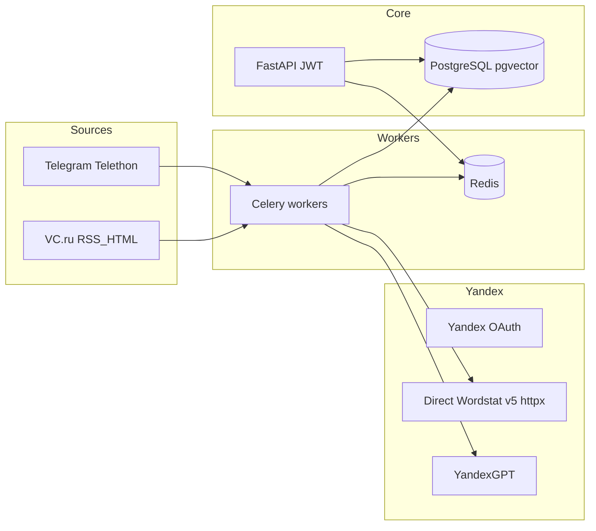

# План реализации приложения «SaaS Niche Finder» (Россия, B2B)

**Версия документа: 2.0 — исправленная, готовая к кодированию**

Рабочая директория: [c:\Users\frolo\Documents\CodeProjects\saas-niche-finder](c:\Users\frolo\Documents\CodeProjects\saas-niche-finder) — репозиторий на старте **пустой**.

---

## 1. Целевая аудитория и ценность

- **Кто:** инди-хакеры, основатели стартапов, продакт-менеджеры B2B, маркетинговые агентства.
- **Ценность:** «Покажи мне 3 B2B-ниши, где конкуренция слабая, а бизнесы готовы платить от 50 000 ₽/мес».
- **Ключевое отличие:** анализ русскоязычных отраслевых сообществ (Telegram, VC.ru) + Яндекс.Вордстат.

## 2. Источники данных (MVP)

| Источник | Тип данных | Инструмент | Приоритет |
|----------|-----------|------------|------------|
| Telegram (каналы/чаты) | Жалобы, вопросы «ищу решение» | Telethon (user account) | Высокий |
| VC.ru (блоги + комментарии) | Кейсы, обсуждения проблем | aiohttp + BeautifulSoup4 | Высокий |
| Яндекс.Вордстат | Объёмы поисковых запросов | HTTP API Директа v5 через **httpx** | Высокий |

## 3. Технологический стек (фиксированные версии)

### Бэкенд

- Python 3.12 (точный патч — при создании venv / Docker-образа)
- FastAPI 0.115+
- SQLAlchemy 2.0+ (async)
- Celery 5.4+ (брокер Redis)
- Redis 7.0+
- PostgreSQL 15 + **pgvector 0.6+**

### NLP / ML

- transformers 4.40+ (Hugging Face)
- `DeepPavlov/rubert-base-cased` (**не** sentence-модель)
- Natasha 1.5+ (сущности)
- YandexGPT API — HTTP через httpx

### Фронтенд

- React 18.3+ (TypeScript)
- Vite 5.2+
- Tailwind CSS 3.4+
- shadcn/ui

### Инфраструктура

- Docker + docker-compose
- GitHub Actions (CI/CD)
- Сервер: Hetzner CX22 (2 vCPU, 4 GB RAM, 40 GB SSD) — **актуальную цену проверить перед заказом**

## 4. Архитектура (целевая)



**Поток данных:** парсеры → классификатор «боль/не боль» + Natasha → агрегация тем → Wordstat (кэш) + YandexGPT (карточки, конкуренты) → скоринг → `niche_ideas` + векторы 768 для similarity.

## 5. Структура репозитория

| Путь | Назначение |
|------|------------|
| `backend/` | FastAPI, `/v1/...`, `/auth/...` |
| `backend/app/models/` | `RawPost`, `NicheIdea`, `WordstatCache`, `User`, `Subscription` |
| `backend/app/services/` | Парсеры, скоринг, Yandex, ЮKassa |
| `backend/app/workers/` | Celery tasks |
| `backend/ml/` | Обучение RuBERT, сохранение весов |
| `frontend/` | Vite + React + TS + Tailwind + shadcn |
| `docker-compose.yml` | api, worker, beat, postgres, redis |
| `tests/fixtures/vc/` | 3–5 HTML снимков VC |
| `.github/workflows/` | CI: lint, pytest, build фронта |

## 6. Детали реализации (пробелы закрыты)

### 6.1. Яндекс.Вордстат — API и лимиты

- **Библиотека:** не использовать несуществующий PyPI-пакет `yandex-direct`; только **httpx** к официальному JSON API.

**URL и методы (зафиксировать в коде; при старте спринта сверить с актуальной справкой Директа v5):**

- Создание отчёта: `POST https://api.direct.yandex.com/json/v5/wordstatreports`  
  Пример тела: `{"method": "get", "params": {"SelectionCriteria": {"Keywords": ["софт для такси"]}, "ReportType": "WORDSTAT_REPORT"}}`
- Получение результата: `GET https://api.direct.yandex.com/json/v5/reports?reportId=<id>`

- **Аутентификация:** `Authorization: Bearer <OAuth-токен>`.
- **Лимиты (ориентир из ТЗ v2, июнь 2025):** 5 запросов/с на токен; до **2000** ключевых слов в одном отчёте; максимум **10** отчётов в очереди на аккаунт.
- **Кэш:** PostgreSQL, TTL **7 дней**.

### 6.2. Telegram — лимиты и аккаунты

- **Библиотека:** Telethon 1.36+
- **Тип:** user account (не бот).
- **Лимиты:** **30 сообщений в минуту** (консервативно); `flood_sleep_threshold=60` (или эквивалентная обработка FloodWait).
- **Старт:** **один** аккаунт; при необходимости — до **3** с резервом.
- **Перед парсингом:** ручная верификация каждого username (существует, открыт, посты за 7 дней). Резервные каналы — раздел 8.

### 6.3. RuBERT

- **Классификация:** `AutoModelForSequenceClassification.from_pretrained("DeepPavlov/rubert-base-cased", num_labels=2)`.
- **Эмбеддинги (pgvector):** последний скрытый слой, **768** измерений; без головы классификации — MeanPool по токенам поверх hidden states (реализацию взять от базовой `AutoModel`/`BertModel`, не путать с `SequenceClassification`).
- **Обучение:** 300 примеров (150/150), **3 эпохи**, `LR=2e-5`, метрики: accuracy/F1 на валидации (цель в ТЗ: **>85%** accuracy).

### 6.4. VC.ru

- aiohttp + BeautifulSoup4; RSS `https://vc.ru/rss`, затем посты и комментарии.
- Фикстуры: `tests/fixtures/vc/` (3–5 HTML).
- Лимиты: `asyncio.sleep` + `random.uniform(1.5, 2.5)` между запросами; 5 User-Agent (Chrome/Firefox/Edge).

### 6.5. Скоринг (без G2)

```
Score = (Wordstat_Growth * 0.4) + (Pain_Frequency * 0.3) - (Competitors_Count * 0.2) + (Budget_Signal * 0.1)
```

- `Competitors_Count`: упоминания SaaS в TG/VC + ручной список (AmoCRM, RetailCRM, YCLIENTS, Битрикс24 и т.д.) + извлечение через YandexGPT; **если нет упоминаний — 0** (штрафа нет).

### 6.6. Авторизация (MVP)

- **JWT** (stateless): библиотека `python-jose[cryptography]` (или эквивалент, согласованный с FastAPI).
- Пользователи в PostgreSQL: email, хеш пароля, подписка.
- Эндпоинты: `/auth/register`, `/auth/login`, `/auth/refresh`.

### 6.7. ЮKassa — рекуррент

- Библиотека: `yookassa`.
- Первый платёж с `save_payment_method: true`; вебхук **`payment.succeeded`** → `subscription_status = active`.
- Отмена: из ЛК — по документации ЮKassa (отвязка/отмена сохранённого метода); **точные вызовы API** сверить при интеграции (названия методов меняются между версиями).

Пример тела создания платежа (ориентир):

```python
payment = Payment.create({
    "amount": {"value": "990.00", "currency": "RUB"},
    "payment_method_data": {"type": "bank_card"},
    "confirmation": {"type": "redirect", "return_url": "https://yourapp.ru/success"},
    "save_payment_method": True,
    "description": "Подписка SaaS Niche Finder",
})
```

### 6.8. API ниш (бэкенд)

- `GET /v1/niches/top?limit=10&min_score=...`
- `GET /v1/niches/search?q=...`
- `GET /v1/niches/{id}/similar`
- `POST /v1/feedback`
- `POST /webhooks/yookassa` (подпись, идемпотентность)

### 6.9. Тариф Free

- **5 карточек ниш в сутки** на пользователя (счётчик на бэкенде).

## 7. Telegram-каналы (основной + резерв)

**Перед неделей 1 — ручная проверка.**

Основной список (20 каналов):

- Стартапы: @startup_news, @vcru, @habr_com, @startup_hub, @startupcommunity
- Маркетинг: @marketing_vc, @smm_peka, @targetology, @marketing_na_rajonah
- Продажи/CRM: @crmforum, @sales_lib, @crm_automation, @bitrix24_ru
- E-commerce: @ecom_news, @seo_news, @ecom_paradise, @online_trade_ru
- Разработка: @python_jobs, @frontendnotebook, @devops_ru

Резерв: @biznests, @producthunt_ru, @ecom_community.

При ошибке «канал не найден» — переключение на резерв из конфига.

## 8. Дорожная карта (6 недель)

| Неделя | Задачи | Контрольные точки |
|--------|--------|-------------------|
| 1 | Верификация Telegram-каналов (ручная); Docker, PostgreSQL+pgvector, Redis; парсер VC с фикстурами | Фикстуры есть; парсер выгружает **100 постов** |
| 2 | Telethon (1 аккаунт, flood wait); сбор **300** сообщений, разметка; fine-tune RuBERT | Accuracy на валидации **>85%** |
| 3 | Wordstat (httpx, OAuth, кэш); YandexGPT; таблицы SQLAlchemy | Первые черновые карточек ниш |
| 4 | FastAPI, JWT, `/niches`, Celery, скоринг | API отдаёт топ-10 ниш с карточками |
| 5 | React, дашборд, карточка ниши, ЛК | Авторизация и просмотр ниш |
| 6 | ЮKassa рекуррент, вебхук; pytest, locust; деплой Hetzner | Регистрация и оплата подписки |

## 9. Тестирование и качество

| Тип | Инструмент | Критерий |
|-----|-----------|----------|
| Модульное | pytest, покрытие **>80%** | Парсеры на фикстурах |
| Интеграционное | тестовая БД, моки внешних API | ETL без ошибок |
| Нагрузочное | locust **100 RPS** | Ответ **<500 ms** |
| Пользовательское | 5–10 бета-тестеров | Оценка ниш **>4/5** |

## 10. Бюджет (3 месяца, ₽)

| Статья | ₽/мес | Примечание |
|--------|-------|------------|
| Hetzner CX22 | ~1 500 | Цену уточнить перед оплатой |
| Прокси | 500 | Ротация IP |
| API Вордстат | 1 000 | После бесплатного лимита |
| YandexGPT | 500 | Карточки |
| ЮKassa | 0 | Комиссия ~3% с платежа |
| **Итого** | **~3 500** | |

## 11. Юридический минимум

- Самозанятый (НПД), «Мой налог» / Госуслуги.
- Налог: 4% (физлица) / 6% (юрлица).
- Договор с ЮKassa как самозанятый.

## 12. Риски и митигация

| Риск | Митигация |
|------|------------|
| Бан Telegram за парсинг | Низкая скорость (30 сообщ/мин), резервный аккаунт |
| Смена лимитов Вордстат | Кэш 7 дней; запасной план — эмуляция браузера (после MVP) |
| Смена вёрстки VC | Регрессия по фикстурам |
| Конкуренция продукта | Уникальные размеченные данные, скоринг, сообщество |

## 13. Критерии готовности MVP

- E2E: VC/TG → БД → классификатор → Wordstat → YandexGPT → API (top/search/similar).
- Подписка: рекуррент, webhook, отмена из ЛК.
- Покрытие **>80%** критичных модулей (парсеры, скоринг, оплата — с моками).

## 14. Примечание по верификации API

Перед мерджем в прод **обязательно** сверить с текущей документацией Яндекс.Директа: точные имена сервисов (`wordstatreports` / отчёты), формат `params` и коды ошибок — чтобы JSON-тела из п. 6.1 остались валидными.
