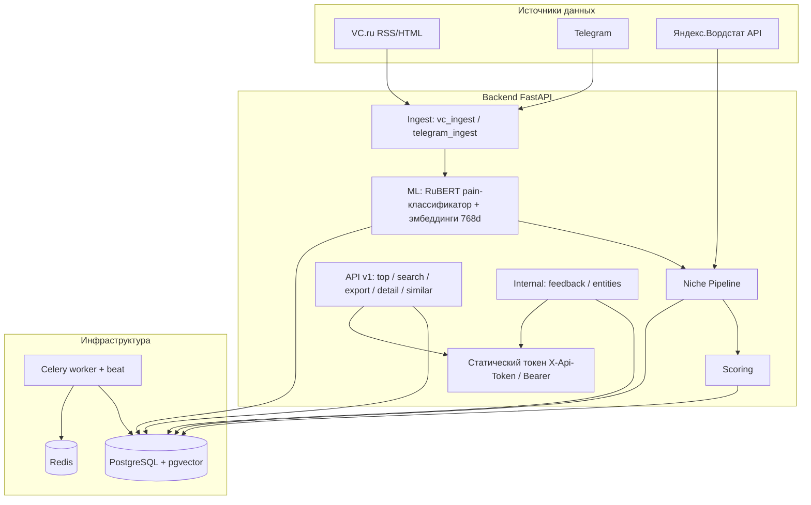

# Project Map — SaaS Niche Finder (личный инструмент)

## Обзор

**SaaS Niche Finder** — личный закрытый инструмент поиска B2B-ниш на русскоязычном рынке. Собирает данные из Яндекс.Вордстат, VC.ru и Telegram, прогоняет через ML-пайплайн (RuBERT) и отдаёт результаты через внутренний API.

Публичный DaaS-слой удалён: нет биллинга (YooKassa), тарифов, подписок, API-ключей, rate limiting и регистрации. Доступ — один статический токен из `.env`.

**Стек:** FastAPI + SQLAlchemy (async) + PostgreSQL/pgvector + Redis + Celery + PyTorch/Transformers (RuBERT).



---

## Структура каталогов

```
saas-niche-finder/
├── backend/                  # FastAPI + Celery + ML (Python ≥3.11)
│   ├── app/
│   │   ├── main.py           # Точка входа FastAPI: роутеры /v1 + /internal, lifespan (pgvector + create_all), /health, /ready
│   │   ├── config.py         # pydantic-settings (БД, Redis, API_TOKEN, Telegram, Яндекс, rubert_pain_model_path)
│   │   ├── deps.py           # verify_api_token — статический токен (X-Api-Token / Bearer), hmac.compare_digest
│   │   ├── api/
│   │   │   ├── v1.py         # /v1: top, search (ILIKE + query_embed pgvector), export (CSV/JSONL), detail, similar
│   │   │   └── niches.py     # /internal: top, search, detail, similar, feedback, entities
│   │   ├── db/               # base.py, session.py (async), vector.py (pgvector cosine)
│   │   ├── ml/               # service.py — RuBERT pain-классификация + эмбеддинги 768-d
│   │   ├── models/           # SQLAlchemy: niche_idea, raw_post, feedback, wordstat_cache
│   │   ├── schemas/          # Pydantic: niches.py (NicheRead, FeedbackCreate/Read, NicheEntityExtractResponse)
│   │   ├── services/         # Бизнес-логика (см. ниже)
│   │   └── workers/          # tasks.py — Celery-пайплайн
│   ├── ml/                   # ML-обучение и артефакты
│   │   ├── train_classifier.py  # Fine-tune RuBERT (pain/not-pain), F1
│   │   ├── embeddings.py     # 768-d эмбеддинги, mean pooling
│   │   ├── build_demo_dataset.py, smoke_embeddings.py, check_artifact_metrics.py
│   │   ├── data/train.jsonl  # Обучающий датасет (в git)
│   │   └── artifacts/rubert-pain-cls/  # Чекпоинт fine-tune (НЕ в git, см. .gitignore) — модель + tokenizer + all_results.json
│   ├── celery_app.py         # Celery + beat-расписание (реальные таски)
│   ├── scripts/migrate_drop_users.sql  # Миграция из DaaS-режима (drop users/api_keys, idempotent)
│   ├── Dockerfile, Dockerfile.ml
│   └── pyproject.toml        # Зависимости (Python ≥3.11)
├── tests/                    # pytest (см. «Тесты») + fixtures/{telegram,vc}/
├── .github/workflows/ci.yml  # CI: ruff check backend tests + pytest (Python 3.12)
├── docker-compose.yml        # postgres+pgvector (pg15), redis, api, worker, beat
├── locustfile.py             # Load-тесты
├── state/                    # business-brief.md, metrics-business.json, revenue/
├── backlog/                  # revenue.yaml, tasks.yaml
├── marketing/                # pricing, landing-hero, onboarding-email, cold-outreach
├── go-to-market/concierge-first/  # (пусто)
└── docs/deploy.md
```

---

## Backend — ключевые модули

### Пайплайн данных (Celery, `app/workers/tasks.py`)
1. `scrape_vcru` / `scrape_telegram` → сохранение `RawPost`
2. `process_raw_posts` → ML-классификация боли + эмбеддинги
3. `aggregate_niches` → сборка `NicheIdea`
4. `update_wordstat` → данные Яндекс.Вордстат
5. `score_niches` → пересчёт скоринга

**Beat-расписание** (`backend/celery_app.py`): scrape VC.ru (ежечасно), scrape Telegram (каждые 2 ч), ML-обработка (каждые 15 мин), агрегация ниш (каждые 30 мин), wordstat (каждые 6 ч), пересчёт скоров (ежедневно 03:00).

### Сервисы (`app/services/`)
| Модуль | Назначение |
|---|---|
| `vc_parser.py` / `vc_ingest.py` | Парсинг VC.ru (RSS + HTML, aiohttp + BeautifulSoup, троттлинг 1.5–2.5 с) |
| `tg_parser.py` / `telegram_ingest.py` / `telegram_collector.py` | Парсинг Telegram (Telethon) |
| `wordstat.py` | Клиент Яндекс.Вордстат / Direct API v5, кэш 7 дней в БД, лимиты 5 RPS |
| `yandex_gpt.py` | YandexGPT — генерация карточки ниши |
| `niche_draft.py` | Сборка черновика: Вордстат + YandexGPT |
| `niche_pipeline.py` | Оркестрация ниши: энричмент поста → NicheIdea → скоринг |
| `scoring.py` | `calculate_score`: wordstat_growth×0.4 + pain×0.3 − competitors×0.2 + budget×0.1 |
| `pain_classifier.py` | Классификатор «боль/не боль» (RuBERT fine-tune или эвристика) |
| `natasha_entities.py` | Извлечение организаций/персон/локаций (Natasha NER) |

### Аутентификация (`app/deps.py`)
- Единственный статический токен из `settings.api_token` (env `API_TOKEN`)
- Принимается в заголовке `X-Api-Token` или `Authorization: Bearer`
- Сравнение через `hmac.compare_digest` (constant-time), без БД

### Модели (`app/models/`)
- `niche_idea.py` — `NicheIdea`: slug, title, summary, score + DaaS-поля (niche_name, category, overall_score, wordstat_*, pain_points_json, competitors_json), эмбеддинг `VectorType(768)`
- `raw_post.py` — `RawPost`: source, external_id, title, body_text, ML-поля (is_processed, is_pain_point, pain_probability, embedding)
- `feedback.py` — оценка ниши (без user_id)
- `wordstat_cache.py` — кэш ответов Вордстата

### ML (`backend/ml/`)
- **Модель:** `DeepPavlov/rubert-base-cased`, бинарная классификация pain/not-pain, эмбеддинги 768-d (mean pooling)
- **Обучение:** `train_classifier.py` — 3 эпохи, lr 2e-5, F1/accuracy; датасет `data/train.jsonl` (в git)
- **Артефакты:** `artifacts/rubert-pain-cls/` — чекпоинт после fine-tune (загружается через `rubert_pain_model_path` из env; `artifacts/` в `.gitignore`, поэтому на CI модель недоступна — сервис работает в fallback-режиме без артефактов). Есть `checkpoint-{30,60,90}` + `all_results.json` с метриками
- Вспомогательные скрипты: `smoke_embeddings.py` (быстрый прогон), `check_artifact_metrics.py` (метрики чекпоинта)

### Инфраструктура
- **PostgreSQL + pgvector** — основное хранилище, векторный поиск
- **Redis** — Celery broker/backend
- **Docker Compose** — 5 сервисов: `postgres`, `redis`, `api`, `worker`, `beat`

---

## API

| Метод | Путь | Описание |
|-------|------|----------|
| GET | `/v1/niches/top` | Топ-ниши по `overall_score` (пагинация, фильтр category) |
| GET | `/v1/niches/search` | Поиск: ILIKE по niche_name/summary_ru или семантический (`query_embed=true`, pgvector cosine) |
| GET | `/v1/niches/export` | Экспорт CSV / JSONL (включая эмбеддинги; объявлен ДО `{niche_id}`) |
| GET | `/v1/niches/{id}` | Детали ниши |
| GET | `/v1/niches/{id}/similar` | Похожие ниши (pgvector cosine, `limit` ≤20) |
| GET | `/internal/niches/*` | Упрощённые топ/поиск/детали/similar |
| POST | `/internal/feedback` | Оценка ниши (`rating` 1–5, без user_id) |
| GET | `/internal/niches/{id}/entities` | Сущности (Natasha NER) |
| GET | `/health`, `/ready` | Healthcheck / готовность БД |

Все `/v1` и `/internal` эндпоинты защищены `verify_api_token` (`X-Api-Token` или `Authorization: Bearer`).

---

## Бизнес-слой (SynGate)

- `state/business-brief.md` — бизнес-контекст
- `backlog/revenue.yaml` — revenue-бэклог
- `marketing/` — pricing, landing-hero, onboarding-email, cold-outreach (публикация через `state/approval_queue.json`)
- Оркестратор: **SynEvo** (`python -m synevo.loop --lane revenue`)

---

## Тесты

`tests/` — `test_api_token` (auth), `test_v1_routes` (в т.ч. регрессия: export не 422), `test_niches_api`, `test_health`, `test_ready`, `test_ml_pipeline`, `test_niche_pipeline`, `test_scoring`, `test_telegram_ingest`, `test_vc_parser`, `test_week3_wordstat`, `test_natasha_entities`. Фикстуры: `tests/fixtures/{telegram,vc}/`. Плюс нагрузочные тесты в `locustfile.py`.

**CI** (`.github/workflows/ci.yml`): Python 3.12, `pip install -e "./backend[dev]"`, `ruff check backend tests`, `pytest` — на push/PR в main/master.

## Запуск

```bash
# Переменные окружения (из корня репозитория — .env читается относительно CWD)
cp .env.example .env
# ВАЖНО: uvicorn запускать ИЗ КОРНЯ (иначе .env не подхватится и API_TOKEN будет default → все запросы 401):
#   .\.venv\Scripts\python.exe -m uvicorn app.main:app --app-dir backend --host 127.0.0.1 --port 8000

# База и Redis
docker compose up -d postgres redis

# Миграция из DaaS-режима (только для существующей БД)
docker compose exec -T postgres psql -U postgres -d niche_finder < backend/scripts/migrate_drop_users.sql

# API (из корня)
pip install -e './backend[dev]'
.\.venv\Scripts\python.exe -m uvicorn app.main:app --app-dir backend --reload

# Celery
celery -A celery_app worker --loglevel=info   # (из backend/; на Windows: cd backend)
celery -A celery_app beat --loglevel=info

# Или всё сразу (5 сервисов)
docker compose up --build

# Тесты и линтер
python -m pytest && python -m ruff check backend tests
```
